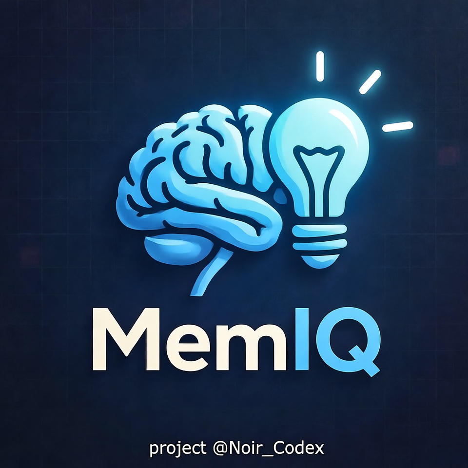

# MemIQ
Telegram bot MemIQ — отправка мемов, фактов и цитат



**Memiq** — лёгкий и весёлый Telegram-бот, который по нажатию кнопки отправляет:  

- **Случайный мем** из вашей коллекции  
- **Цитату** из файла `quotes.txt`  
- **Факт** из файла `facts.txt`  

Отлично подходит для развлечения, мотивации или просто чтобы поднять настроение!  

---

## Автор

**Автор проекта:** **@Noir_Codex**  
*GitHub:* [@Noir_Codex](https://github.com/Noir_Codex)  
*Telegram:* [@Noir_Codex](https://t.me/Noir_Codex)  

> Хочешь свой бот? Пиши — помогу настроить!  

---

## Функционал

| Кнопка     | Что делает |
|-----------|------------|
| **Мем**   | Отправляет случайное изображение из папки `memes/` |
| **Цитата**| Отправляет случайную цитату из `quotes.txt` |
| **Факт**  | Отправляет случайный факт из `facts.txt` |

> После каждого действия — кнопки остаются, можно жать снова!

---

## Установка и запуск

### 1. Клонируйте репозиторий
```bash
git clone https://github.com/Noir_Codex/Memiq.git
cd Memiq
git clone https://github.com/Noir_Codex/Memiq.git
cd Memiq
```
### 2. Создайте виртуальное окружение
```bash
python -m venv venv
source venv/bin/activate        # Linux / macOS
venv\Scripts\activate           # Windows
```
### 3. Установите зависимости
```bash
pip install aiogram
```
### 4. Настройте конфигурацию
```bash
1.Создайте бота через @BotFather и получите токен
2.Откройте config.py и вставьте токен:
token = "ВАШ_ТОКЕН_ЗДЕСЬ"
3.Укажите абсолютные пути к файлам и папкам:
photo = FSInputFile("/путь/к/Memiq/logo.png")
images_folder = "/путь/к/Memiq/memes"
```
### 5. Подготовьте контент
```bash
quotes.txt — по одной цитате на строку
facts.txt — по одному факту на строку
Папка memes/ — кидайте любые изображения (.png, .jpg, .jpeg, .gif, .webp)
```
### 6. Запустите бота
```bash
python memiq.py
```
### Готово! Бот онлайн и ждёт команду /start

### Особенности
### Защита от дублирования команды /start (не чаще 1 раза в секунду)
### Автоматическая загрузка списка мемов при старте
### Поддержка всех популярных форматов изображений
### Чистый, документированный код
### Легко кастомизировать под свои нужды


### Создано с любовью к Telegram и хорошему настроению
### С уважением | @Noir_Codex
